# Universidad Católica Boliviana Cochabamba
## Departamento de Ingeniería y Ciencias Exactas
## [SIS-234] Internet De Las Cosas
### Carrera de Ingeniería de Sistemas

---

# Informe sobre:
## Integración de un objeto inteligente con Alexa mediante MQTT y AWS.

### Evaluación de la Materia Internet de las Cosas

**Autores:**

- Vargas Prado Ariana Nicole  
- Zubieta Sempertegui Andres Ignacio  

---

Cochabamba - Bolivia  
Mayo 2026 

# 1. Requerimientos Funcionales y No Funcionales
## Requerimientos Funcionales

- El sistema debe permitir la lectura de tarjetas mediante dos sensores RFID-RC522 uno de entrada y otro de salida. 
- El sistema debe identificar y diferenciar cada tarjeta RFID registrada.
- El sistema debe enviar el ID de la tarjeta leída hacia AWS IoT Core mediante MQTT.
- El sistema debe actualizar el estado reportado del dispositivo en el Shadow de AWS IoT Core.
- El sistema debe recibir comandos desde AWS IoT Core a través del Device Shadow desde Alexa y IoT core, los comandos se dividen en: 
    #### Comandos de acción del sistema:
   - Abrir puerta (SetModeOpen)
   - Cerrar puerta (SetModeClose)
   - Automatizar la puerta (SedModeAuto)
   - Cambiar temporizador de puerta (SetAutoTimer)
   - Registrar un RFID autorizado (AddNewTag)
   - Quitar un RFID registrado (RemoveTag) 
   -  Registar el ultimo Tag percibido (RegisterLastTagIntent)
    #### Comandos para recibir informacióm del sistema: 
   - Obtener estado del motor (GetMotorState) 
   - Obtener el tiempo de la ultima vez que se abrió la puerta (GetLastOpenTime) 
   - Obtener el ultimo tag registrado (GetLastTag) 
   - Obtener el estado de la puerta (GetDoorState)
   - Conformar el registro del ultimo Tag (ConfirmTagRegistrationIntent)
- El sistema debe controlar el motor DC 12v to 24v QK1-0908 RN855613 en función de los comandos anteriormente mencionados. 
- El sistema debe permitir el movimiento del motor cuando una tarjeta autorizada sea detectada.
- El sistema debe negar el acceso cuando una tarjeta no autorizada sea detectada.
El sistema debe permitir el control del motor mediante comandos a través de Alexa.
El sistema debe permitir que Alexa registre y mande las siguientes categorías:
   - Estado de la puerta: si está abierta o cerrada
   - Estado del motor: si está en movimiento o si está parado 
   - Información del sensor: si percibió algo, en qué momento percibió la mascota, que mascota percibió.
   - Nombre de la mascota.
- El sistema debe guardar datos en una Base de Datos (DynamoDB) cuando los sensores detecten un Tag.
- El sistema debe guardar datos en DynamoDB las veces que se envio un comando de apertura, al Shadow del Objeto Inteligente.

## Requerimientos No Funcionales

- El sistema debe garantizar una comunicación segura con AWS IoT Core (uso de certificados y TLS).
- El sistema debe tener una latencia de respuesta menor a 5 segundos entre comando y acción.
- El sistema debe ser escalable para integrar más sensores o actuadores en el futuro.
- El sistema debe ser modular, permitiendo separar lógica de hardware, red y control.
- El sistema debe manejar errores de conexión (reintentos automáticos a AWS).
- El sistema debe ser compatible con redes WiFi estándar (802.11 b/g/n).
- El sistema debe registrar logs básicos para depuración y monitoreo.
- El sistema debe ser fácil de usar mediante comandos simples en Alexa.


# 2. Diseño del Sistema

## 2.1 Diagrama de circuito
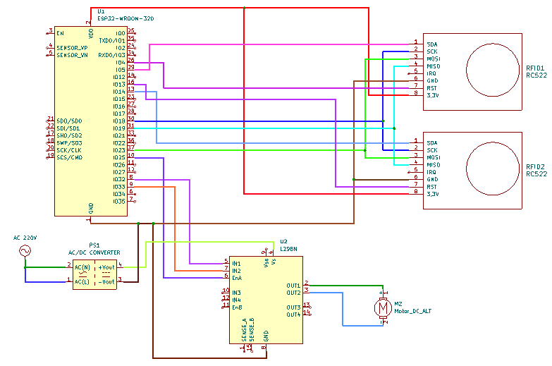
## 2.2 Diagrama de arquitectura del sistema
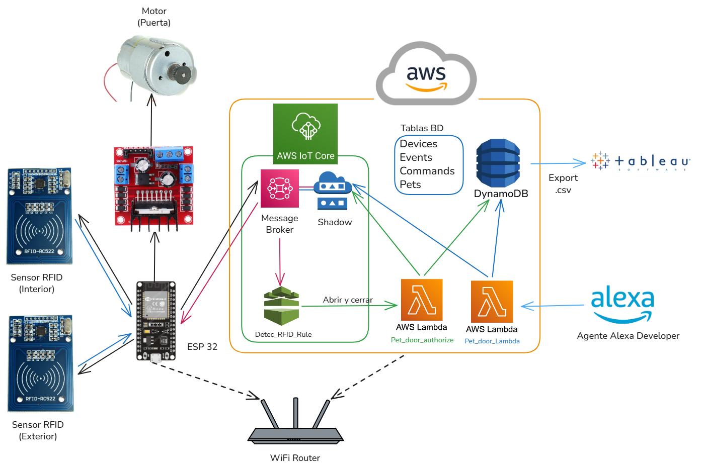
## 2.3 Diagramas estructurales y de comportamiento
### 2.3.1 Diagrama de secuencia
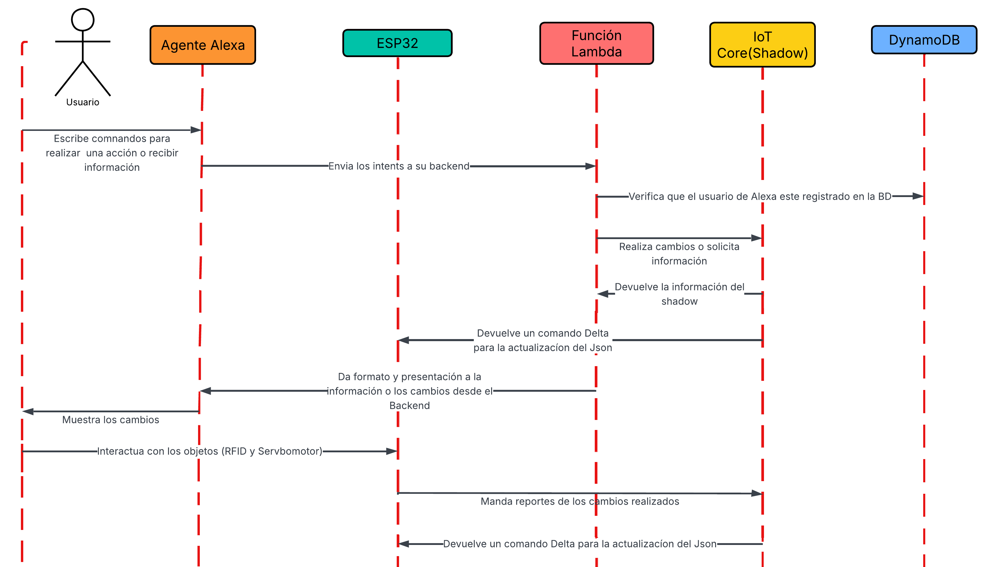
### 2.3.2 Diagrama UML
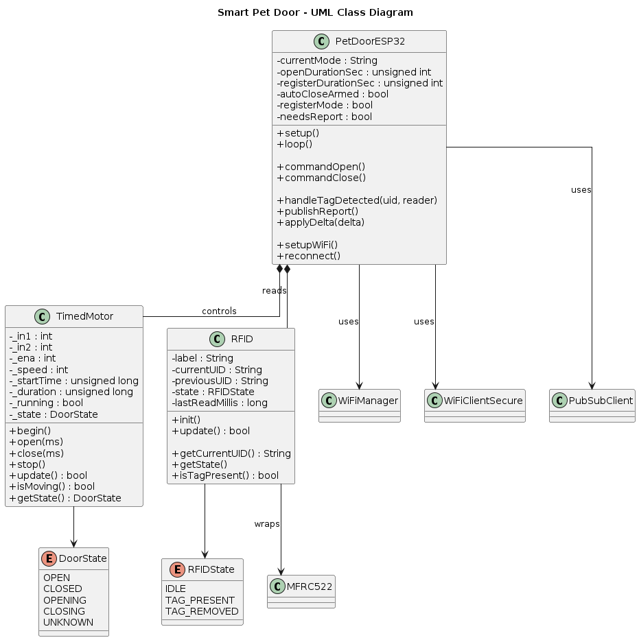

### 2.4 Diseño de la skill de Alexa 

#### Nombre de la Skill

**Smart_Pet_Door**

#### Invocation Name

**Puerta Inteligente**

#### Tabla de Intents

| Intent | Función | Slot | Ejemplo de comando |
|----------|----------|----------|-------------------|
| ConnectToDoorIntent | Conectar una puerta según ubicación | `location` | "Conectar con la puerta de entrada" |
| SetModeAutoIntent | Activar modo automático | No tiene | "Activa modo automático" |
| SetModeClosedIntent | Cerrar y bloquear la puerta | No tiene | "Cerrar la puerta" |
| SetModeOpenIntent | Abrir la puerta | No tiene | "Abrir la puerta" |
| AddNewTagIntent | Iniciar registro de una mascota | `petName` | "Registrar mascota llamada Luna" |
| ConfirmTagRegistrationIntent | Confirmar registro después de acercar el tag | No tiene | "Confirmar registro" |
| RegisterLastTagIntent | Registrar directamente el último tag detectado | `petName` | "Registrar último tag como Rocky" |
| RemoveTagIntent | Eliminar una mascota | `petName` | "Eliminar mascota Luna" |
| SetAutoTimerIntent | Configurar tiempo de apertura | `openTime` | "Timer de apertura 30 segundos" |
| SetRegisterDurationIntent | Configurar duración de registro | `registerTime` | "Tiempo de registro 5 segundos" |
| GetDoorStateIntent | Consultar estado de la puerta | No tiene | "¿La puerta está abierta?" |
| GetMotorStateIntent | Consultar estado del motor | No tiene | "¿Cómo está el motor?" |
| GetLastTagIntent | Consultar la última detección RFID | No tiene | "¿Cuál fue el último tag?" |
| GetLastOpenTimeIntent | Consultar última apertura | No tiene | "¿Cuándo se abrió la puerta?" |
| GetListOfPetsIntent | Mostrar mascotas registradas | No tiene | "Listar mascotas" |

#### Flujo de conversación

##### Apertura de puerta

```text
Usuario
    ↓
"Abre la puerta"

Alexa Skill
    ↓
SetModeOpenIntent
    ↓
AWS Lambda procesa la solicitud
    ↓
Actualización del Device Shadow en AWS IoT Core
    ↓
ESP32 recibe el comando
    ↓
Servo acciona la apertura
    ↓
Alexa responde:

"La puerta fue abierta."
```

##### Registro de una mascota

```text
Usuario
    ↓
"Registrar mascota Oliver"

Alexa Skill
    ↓
AddNewTagIntent
    ↓
AWS Lambda activa modo registro
    ↓
Actualización del Device Shadow
    ↓
ESP32 entra en modo registro
    ↓
Alexa responde:

"Modo de registro activado.
Acerca el tag y di confirmar registro"

Usuario
    ↓
Acerca el RFID
    ↓
"Confirmar registro"

Alexa Skill
    ↓
ConfirmTagRegistrationIntent
    ↓
Lee el último tag detectado
    ↓
Guarda información en DynamoDB
    ↓
Alexa responde:

"Oliver fue registrado correctamente."
```

### 2.5 Diseño Modelo de Datos 

- La tabla `devices` almacena todas las puertas inteligentes asociadas a un usuario.

- La tabla `pets` almacena las mascotas registradas para cada puerta inteligente, incluyendo el nombre de la mascota y el identificador RFID asociado.

- La tabla `events` almacena cada evento generado cuando una etiqueta RFID es detectada por alguno de los sensores, registrando información como el lector utilizado, el identificador RFID, la fecha y hora del evento, y la acción tomada por el sistema.

- La tabla `commands` almacena el historial de comandos enviados a la puerta inteligente, incluyendo comandos de apertura, cierre, registro de etiquetas, cambios de configuración y otras acciones ejecutadas por el sistema o mediante Alexa. 

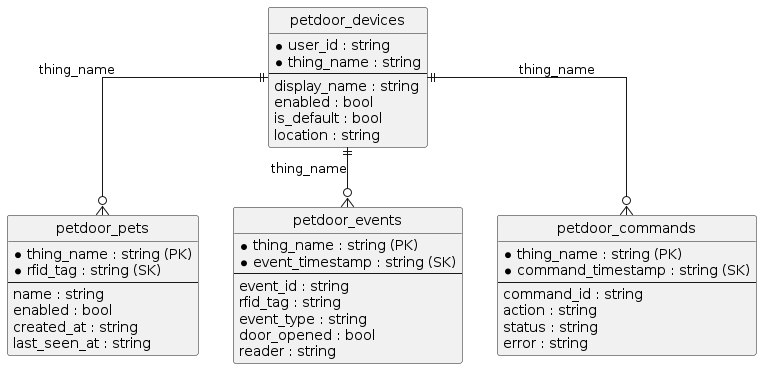 

### 2.6 Visualización Gráfica 
#### 2.6.1 Tráfico de uso de la puerta por día de la semana y hora del día 
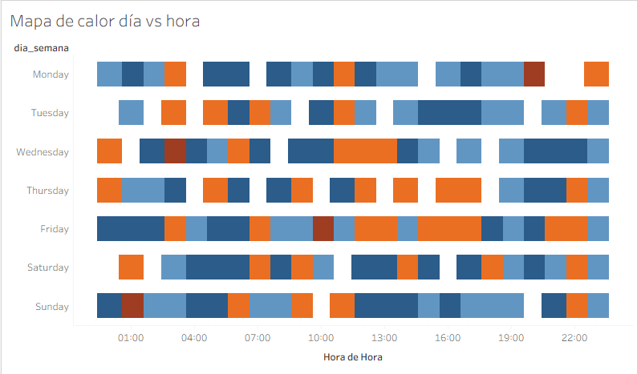 

#### 2.6.2 Distribución de uso de la puerta por mascota
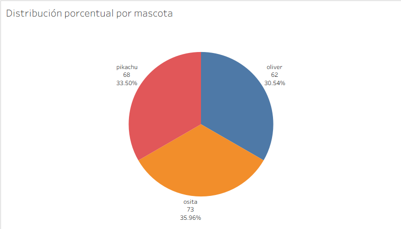 

#### 2.6.3 Primera hora de salida registrada por día para una mascota
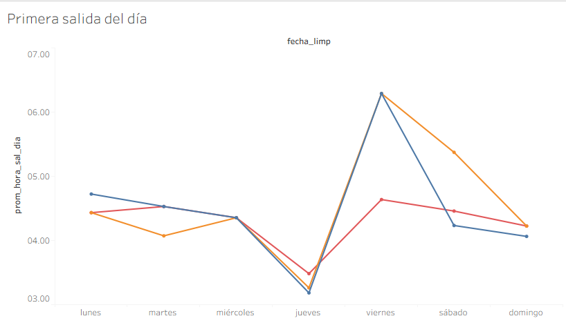 

#### 2.6.4 Última hora de entrada registrada por día para una mascota
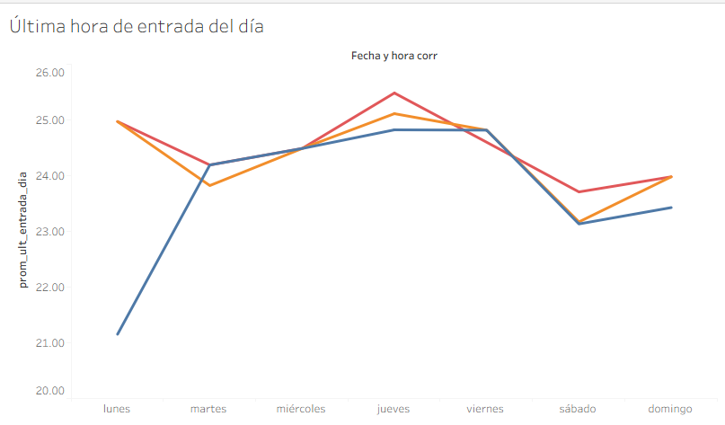 

#### 2.6.5 Distribución de Accesos por Hora del Día
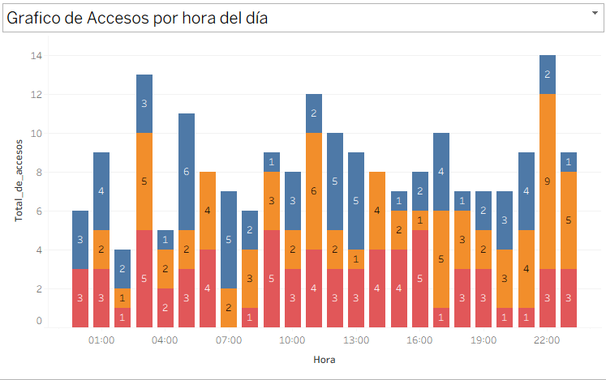 

#### 2.6.6 Indicadores Clave de Desempeño del Sistema
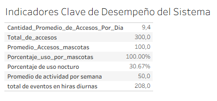 


# 3. Implementación

## 3.1 Código fuente documentado

[Enlace a GitHub] https://github.com/Andrezubi/Practica4-IoT-PetDoor

## 3.2 Configuraciones en Alexa (Skill e Interaction Model)

1. Ingresar a **Alexa Developer Console**.

2. Crear una nueva Skill.

3. Configurar los parámetros iniciales:

   - Nombre de la Skill: `SmartPetDoor`
   - Locale: `Spanish (US)`
   - Tipo de experiencia: `Other`
   - Modelo: `Custom`
   - Hosting Service: `Provision your own`
   - Template: `Start From Scratch`

4. Definir el **nombre de invocación** de la Skill:

   puerta inteligente

5. Crear todos los **Intents** definidos previamente en el diseño de la Skill, junto con sus respectivos **slots** y **utterances**.

   Consideraciones:

   - Para valores numéricos se utilizó el slot:
   
     AMAZON.FOUR_DIGIT_NUMBER
    
   - Para entradas de texto se utilizó:

     AMAZON.SearchQuery

   - Se agregaron suficientes utterances para mejorar el reconocimiento de lenguaje natural.

6. Ir al menú **Endpoint**.

7. Copiar el **Skill ID** generado automáticamente.

8. Ir a la función **AWS Lambda** que funcionará como backend.

9. Agregar un **trigger de tipo Alexa Skill**.

10. Pegar el **Skill ID** copiado anteriormente.

11. Desde la función Lambda copiar el **ARN (Amazon Resource Name)**.

12. Volver a la configuración de **Alexa Endpoint**.

13. Pegar el ARN en la opción:

   Default Region

14. Guardar los cambios.

15. Presionar:

   Build Model

16. Esperar a que finalice la compilación y verificar que no existan errores.

## 3.3 Configuraciones en AWS (IoT Core, Rules y Lambda )

## Configuración del Thing

- Ingresar a **AWS Console**
- Entrar a **IoT Core**
- Ir al menú **Devices**
- Seleccionar **Things**
- Presionar **Create Things**
- Escoger **Create single thing**
- Definir el nombre del Thing:

```text
Thing Name: pet_door_esp32
```

- En **Device Shadow** escoger:

```text
Classic Shadow
```

- Definir un Shadow inicial con la siguiente estructura:

```json
{
  "state": {
    "desired": {
      "config": {
        "mode": "auto",
        "open_duration_sec": 15,
        "register_duration_sec": 20
      },
      "door_command": {
        "action": "open",
        "request_id": "cmd-6cb7f4e2"
      }
    },
    "reported": {
      "config": {
        "mode": "auto",
        "open_duration_sec": 15,
        "register_duration_sec": 20
      },
      "door": {
        "state": "closed",
        "motor_state": "idle",
        "last_opened_at": "2026-05-12T01:15:40Z",
        "last_command_id": "cmd-184"
      },
      "last_event": {
        "reader": "exit",
        "tag": "24:9F:2A:57",
        "detected_at": "2026-05-24T19:37:05Z",
        "event_id": "5d53afa2-c109-49d1-9a2c-e4d787ae70d8"
      }
    }
  }
}
```

- Escoger:

```text
Auto-generate a new certificate
```

---

### Configuración de Policy

- Ir a **Policies**
- Presionar **Create Policy**
- Definir:

```text
Policy Name: pet_door_esp32_Policy
```

- Crear las siguientes reglas:

| Policy Effect | Policy Action | Policy Resource |
|---------------|---------------|-----------------|
| Allow | iot:Publish | * |
| Allow | iot:Subscribe | * |
| Allow | iot:Connect | * |
| Allow | iot:Receive | * |

- Seleccionar la Policy creada previamente
- Presionar **Create Thing**

---

### Descarga de certificados

Una vez creado el Thing, AWS permitirá descargar automáticamente los certificados necesarios para establecer una comunicación segura entre el ESP32 y AWS IoT Core.

Descargar los siguientes archivos:

```text
Amazon Root CA 1
Private Key File
Device Certificate
```

Posteriormente se debe copiar el contenido de los certificados dentro del código principal del ESP32 en las variables correspondientes:

```cpp
const char AMAZON_ROOT_CA1[] PROGMEM = R"EOF(
...
)EOF";

const char CERTIFICATE[] PROGMEM = R"KEY(
...
)KEY";

const char PRIVATE_KEY[] PROGMEM = R"KEY(
...
)KEY";
```

Estos certificados permiten implementar autenticación mediante TLS y asegurar la comunicación MQTT entre el dispositivo y AWS IoT Core.


## Configuración de funciones Lambda

Las siguientes configuraciones deben realizarse para ambas funciones Lambda:

- Backend de Alexa
- Lógica de procesamiento de eventos del Rule

### Creación de la función

- Ir a **AWS Lambda**
- Presionar **Create Function**
- Definir:

```text
Runtime: Python 3.14
```

- Definir el nombre correspondiente:

```text
petdoor_alexa_backend
petdoor_iot_rule_logic
```

- Presionar **Create Function**

- Subir el código fuente correspondiente.

Para la función Lambda del backend de Alexa también debe cargarse el paquete comprimido de despliegue:

```text
deployment.zip
```

(Archivo presente dentro del repositorio del proyecto).

---

### Configuración de Trigger

Presionar **Add Trigger**

Seleccionar el tipo de origen correspondiente.

#### Trigger para Lambda de lógica IoT

Seleccionar:

```text
Source: AWS IoT
```

Configurar:

```text
Rule Type: Custom IoT Rule
Existing Rule: [Regla creada previamente]
```

Presionar:

```text
Add
```

---

#### Trigger para Lambda del backend Alexa

Seleccionar:

```text
Source: Alexa
```

Configurar:

```text
Skill ID Verification: Enable
Skill ID: [ID de la Skill]
```

Presionar:

```text
Add
```

---

### Configuración de permisos IAM

- Ir a **AWS IAM**
- Entrar al menú **Roles**
- Seleccionar el rol generado automáticamente para la función Lambda
- Presionar **Add permissions**
- Seleccionar **Attach Policies**

Agregar las siguientes políticas:

| Política |
|-----------|
| AmazonDynamoDBFullAccess |
| AWSIoTFullAccess |

Presionar:

```text
Add permissions
```

- Volver a Lambda
- Presionar:

```text
Deploy
```

---

## Configuración de IoT Rule

- Entrar a **AWS IoT Core**
- Ir al menú **Message Routing**
- Seleccionar **Rules**
- Presionar **Create Rule**

Definir:

```text
Rule Name: petdoor_event_rule
```

Definir el SQL Statement:

```sql
SELECT
    topic(3) AS thing_name,

    current.state.reported.last_event.event_id AS event_id,

    current.state.reported.last_event.reader AS reader,

    current.state.reported.last_event.tag AS tag,

    current.state.reported.last_event.detected_at AS detected_at,

    current.state.reported.config.mode AS mode,

    current.state.reported.door.state AS door_state,

    timestamp() AS aws_timestamp

FROM '$aws/things/+/shadow/update/documents'

WHERE
    startswith(topic(3), 'pet_door')
    AND current.state.reported.last_event.event_id <>
        previous.state.reported.last_event.event_id
```

---

### Configuración del Rule Action

- Presionar **Add Rule Action**
- Seleccionar:

```text
Action Type: Lambda
```

- Escoger la función Lambda creada previamente

```text
petdoor_iot_rule_logic
```

- Presionar:

```text
Create Rule
```

# 4. Pruebas y Validaciones

## 4.1 Prueba de exactitud de distancia

Para evaluar la exactitud del sensor RFID-RC522 se realizaron 16 mediciones de distancia máxima de detección, acercando lentamente la tarjeta RFID hasta identificar el punto límite en el que el sensor lograba reconocerla correctamente.

Los resultados obtenidos muestran que el sensor mantiene una distancia de detección estable y consistente, con valores que oscilan principalmente entre 3.2 cm y 3.7 cm. Se registró un único valor atípico de 6.5 cm, el cual se considera una medición aislada probablemente ocasionada por variaciones en la orientación de la tarjeta o interferencias externas.

A partir de los datos registrados se obtuvo:

- Distancia promedio de detección: **3.68 cm**
- Distancia mínima registrada: **3.2 cm**
- Distancia máxima registrada: **6.5 cm**
- Rango frecuente de funcionamiento: **3.3 cm a 3.7 cm** 

## 4.2 Prueba de interferencia según distintos materiales

Para analizar el comportamiento del sensor RFID-RC522 frente a distintos materiales, se realizaron pruebas colocando diferentes superficies entre la tarjeta RFID y el sensor, manteniendo una distancia aproximada de entre 1 cm y 3 cm.

Los materiales utilizados fueron:

- Cartón de 1.2 cm de grosor.
- Plastoformo de 1.4 cm de grosor.
- Vidrio de 0.5 cm de grosor.
- Madera de 1.5 cm de grosor.
- Tela de 3.4 cm de grosor.
- Plástico de 3.3 cm de grosor.
- Aluminio de 0.5 cm de grosor.

Durante las pruebas se realizaron 10 mediciones por material para determinar si el sensor lograba detectar correctamente la tarjeta y si existía reducción en la distancia útil de lectura.

Resultados obtenidos:

- **Cartón:** detección exitosa en el 100% de las pruebas, sin reducción apreciable de distancia.
- **Plastoformo:** detección exitosa en el 100% de las pruebas, aunque se observó una disminución moderada de la distancia útil.
- **Vidrio:** detección exitosa en el 100% de las pruebas, pero con interferencia considerable en la estabilidad de lectura.
- **Madera:** detección exitosa en el 100% de las pruebas, con ligera reducción de distancia.
- **Tela:** detección exitosa en el 100% de las pruebas, sin efectos relevantes.
- **Plástico:** detección exitosa en el 100% de las pruebas, sin efectos significativos.
- **Aluminio:** el sensor no logró detectar la tarjeta en ninguna prueba, presentando además fallos temporales de lectura posteriores a la interferencia.

Los resultados muestran que los materiales no metálicos afectan mínimamente el funcionamiento del sensor, mientras que el aluminio genera una interferencia total debido a las propiedades electromagnéticas del material.

## 4.3 Prueba de tiempo de respuesta del sensor

Para evaluar el tiempo de respuesta del sensor RFID-RC522 se realizaron mediciones relacionadas con:

- Tiempo de reconocimiento de la tarjeta.
- Tiempo que tarda el sensor en dejar de detectar la tarjeta luego de alejarla.

Durante las pruebas se observó que el tiempo de lectura fue prácticamente instantáneo, por lo que no pudo medirse manualmente con precisión utilizando cronómetro.

En cambio, sí se logró medir el tiempo de “olvido” del sensor, obteniéndose los siguientes resultados:

- Tiempo promedio de olvido: **1.57 segundos**
- Tiempo mínimo registrado: **1.33 segundos**
- Tiempo máximo registrado: **1.86 segundos**
- Desviación estándar: **0.14 segundos**

Estos resultados muestran que el sensor posee una detección rápida y estable, manteniendo temporalmente el último estado detectado antes de reiniciarse.

## 4.4 Prueba de lectura continua

Se realizó una prueba de funcionamiento continuo dejando una tarjeta RFID sobre el sensor durante periodos prolongados de tiempo para verificar si existían pérdidas de conexión o fallos de lectura.

Las pruebas se realizaron desde 1 minuto hasta 10 minutos continuos.

Resultados obtenidos:

- El sensor mantuvo la detección activa durante todo el tiempo de prueba.
- No se presentaron pérdidas de conectividad.
- No se detectaron reinicios ni desconexiones del sistema.
- La estabilidad fue del 100% durante los 10 minutos evaluados.

## 4.5 Prueba de interferencia entre tarjetas

Se realizó una prueba utilizando dos tarjetas RFID simultáneamente con el objetivo de determinar el comportamiento del sensor al detectar múltiples identificadores cercanos.

Resultados obtenidos:

- El sensor logró detectar ambas tarjetas.
- El sistema alternaba continuamente entre los IDs detectados.
- El cambio de identificación ocurría de forma rápida y constante mientras ambas tarjetas permanecían cerca del sensor.
- Cuando las tarjetas fueron colocadas perpendicularmente al sensor, ninguna pudo ser detectada.

Esto demuestra que el sensor RFID-RC522 no está diseñado para manejar múltiples tarjetas simultáneamente en espacios reducidos, ya que se producen conflictos de lectura.

## 4.6 Prueba de comportamiento mecánico del motor DC

Se evaluó la resistencia del motor DC frente a distintos materiales de interferencia.

Los resultados muestran que el motor no puede ser detenido manualmente (dedos) debido a su alta velocidad y torque. Materiales como madera, vidrio, metal y cartón lograron detener el sistema en todos los casos, mientras que el plastoformo no lo detuvo, evidenciando que el motor puede atravesar materiales de baja densidad.

En general, el sistema presenta alta potencia mecánica con capacidad de superar interferencias ligeras, pero con limitaciones frente a materiales rígidos.


## 4.7 Prueba de rendimiento en función del tiempo de activación

Se evaluó la relación entre tiempo de activación y desplazamiento.

Para 1 s se obtuvo un promedio de 18.81 ± 0.77, para 0.8 s un promedio de 15.57 ± 0.76, y para 0.5 s un promedio de 9.89 ± 1.01.

Los resultados muestran una relación proporcional entre el tiempo de activación y el desplazamiento, con baja variabilidad en las mediciones.


## 4.8 Prueba de funcionamiento continuo del motor DC

El motor operó durante 9 minutos sin interrupciones, sin pérdida de velocidad ni sobrecalentamiento significativo.

Se observó estabilidad mecánica durante toda la prueba, indicando un funcionamiento continuo confiable en el rango evaluado.


## 4.9 Prueba de obstrucción del motor DC

El motor no pudo ser detenido por intervención manual directa.

Materiales como madera, vidrio, metal y cartón detuvieron el sistema, mientras que el plastoformo no generó interferencia significativa.

Los resultados evidencian alta capacidad de fuerza del motor, con resistencia a obstrucciones ligeras y limitación frente a materiales rígidos.

# 4.10 Prueba de velocidad de respuesta del sistema

Se realizó una prueba para medir el tiempo de respuesta total del sistema desde que se ejecuta un comando mediante Alexa hasta que el servomotor realiza la acción correspondiente.

Para esta prueba se enviaron múltiples comandos de apertura y cierre de puerta utilizando Alexa, registrando el tiempo requerido para que el sistema procese el comando mediante AWS IoT Core y MQTT hasta activar el servomotor.

Resultados obtenidos:

- Tiempo promedio de respuesta: **3.44 segundos**
- Tiempo mínimo registrado: **2.95 segundos**
- Tiempo máximo registrado: **4.10 segundos** 

# 4.11 Prueba de flujo completo de autenticación RFID

Se realizó una prueba para validar el funcionamiento completo del flujo de autenticación RFID, verificando la detección de tarjetas, el envío de información mediante MQTT, la actualización del Device Shadow, la apertura de la puerta y el almacenamiento de eventos en la base de datos.

Durante la prueba se utilizaron tarjetas autorizadas y no autorizadas tanto en el sensor de entrada como en el sensor de salida.

Observación importante:

- Solo las tarjetas 1 y 2 se encontraban registradas dentro del sistema.

Resultados obtenidos:

- Detección correcta de RFID: **100%**
- Envío correcto mediante MQTT: **100%**
- Apertura correcta con tarjetas autorizadas: **100%**
- Bloqueo de tarjetas no autorizadas: **100%**
- Registro exitoso en base de datos: **100%**

# 4.12 Prueba de comandos de Alexa y sincronización con AWS

Se realizó una prueba para verificar el funcionamiento de los comandos enviados desde Alexa y su sincronización con AWS IoT Core, el Device Shadow, el servomotor y la base de datos.

Durante las pruebas se evaluaron comandos relacionados con:

- Apertura y cierre de puerta.
- Automatización del sistema.
- Configuración de temporizador.
- Registro y eliminación de etiquetas RFID.
- Consultas de estado e información del sistema.

En cada comando se verificó:

- Reconocimiento correcto por Alexa.
- Actualización del Device Shadow.
- Movimiento del servomotor.
- Registro de información en la base de datos.

Resultados observados durante las pruebas:

- Los comandos **AbrirPuerta** y **CerrarPuerta** lograron modificar correctamente el Device Shadow y activar el movimiento del servomotor.
- Los comandos **AutomatizarPuerta**, **CambiarTemporizador** e **IniciarRegistroRFID** lograron modificar el Device Shadow.
- Los comandos **QuitarUnRFID** y **RegistrarUltimoRFID** lograron modificar el Device Shadow y almacenar información correctamente en la base de datos.
- Los comandos de consulta como **ObtenerEstadoPuerta**, **ObtenerEstadoMotor**, **ObtenerUltimaAperturaPuerta** y **ObtenerUltimoTag** fueron reconocidos por Alexa.
- El comando **ConfirmarRegistroTag** logró almacenar correctamente información en la base de datos.

# 5. Resultados

## 5.1 Resultados de integración del sistema distribuido

El sistema implementado logró integrar correctamente los módulos ESP32, el sensor RFID-RC522, el motor DC 12–24V QK1-0908 RN855613, AWS IoT Core, MQTT y Alexa mediante comunicación WiFi.

Se verificó el funcionamiento correcto de la lectura de tarjetas RFID, el envío de información mediante MQTT hacia AWS IoT Core, la actualización del Device Shadow, la recepción de comandos desde Alexa y el control del motor DC.

El sistema ejecutó correctamente las acciones de apertura y cierre de la puerta, evidenciando una integración funcional entre hardware, nube y asistentes virtuales.

## 5.2 Resultados de exactitud de distancia

Los resultados muestran que el sensor RFID-RC522 presenta una distancia de lectura efectiva promedio de aproximadamente **3.68 cm**, con valores concentrados entre **3.3 cm y 3.7 cm**.

Esta variación baja indica un comportamiento estable en el rango de operación esperado para sistemas de control de acceso de corto alcance.

## 5.3 Resultados de interferencia según materiales

Las pruebas evidencian que los materiales no metálicos no afectan significativamente la lectura del sensor RFID.

Materiales como cartón, tela y plástico presentaron una tasa de detección del 100%, mientras que el aluminio bloqueó completamente la comunicación RFID debido a sus propiedades conductoras.

Esto confirma la sensibilidad del sistema frente a materiales metálicos.

## 5.4 Resultados de tiempo de respuesta del sensor

El sensor RFID-RC522 presentó tiempos de lectura estables dentro del rango operativo.

El tiempo promedio de liberación de detección de una tarjeta fue de **1.57 segundos**, con una desviación estándar de **0.14 segundos**, lo que indica variabilidad baja en el comportamiento del sensor.

## 5.5 Resultados de lectura continua

Durante las pruebas de lectura continua, el sistema mantuvo operación estable durante 10 minutos sin pérdida de detección ni desconexiones.

Esto evidencia que el sistema puede operar de manera continua sin degradación funcional en el periodo evaluado.

## 5.6 Resultados de interferencia entre tarjetas

Las pruebas mostraron que el sensor puede detectar múltiples tarjetas cercanas, pero no mantiene una lectura simultánea estable.

Cuando dos tarjetas estuvieron próximas, el sistema alternó entre identificadores, generando variaciones en la lectura. La orientación de las tarjetas también influyó en la estabilidad de la detección.

## 5.7 Resultados de precisión del motor DC

Las pruebas realizadas al motor DC mostraron un comportamiento estable en el desplazamiento del sistema.

Para 1 segundo de activación se obtuvo un promedio de **18.81 ± 0.77**, para 0.8 segundos un promedio de **15.57 ± 0.76**, y para 0.5 segundos un promedio de **9.89 ± 1.01**.

Estos resultados muestran una relación consistente entre el tiempo de activación y el desplazamiento, con baja dispersión en las mediciones.

## 5.8 Resultados de funcionamiento continuo del motor DC

El motor DC operó durante 9 minutos de forma continua sin interrupciones ni variaciones significativas de velocidad.

No se observó sobrecalentamiento relevante ni pérdida de rendimiento durante el periodo de prueba, lo que indica estabilidad operativa en condiciones de uso continuo.

## 5.9 Resultados de pruebas de obstrucción del motor DC

El motor no pudo ser detenido mediante intervención manual directa.

Materiales como madera, vidrio, metal y cartón lograron detener el sistema, mientras que el plastoformo no generó interferencia significativa.

Estos resultados muestran que el sistema puede superar interferencias ligeras, pero presenta limitaciones frente a materiales de alta rigidez.

## 5.10 Resultados de prueba de velocidad de respuesta

El sistema presentó un tiempo promedio de respuesta de **3.44 segundos**, manteniéndose por debajo del límite establecido de 5 segundos.

La mayoría de respuestas se concentraron entre **3 y 4 segundos**, lo que indica un comportamiento estable en la comunicación entre Alexa, AWS IoT Core, MQTT y el ESP32.

## 5.11 Resultados del flujo de autenticación RFID

El sistema diferenció correctamente entre tarjetas autorizadas y no autorizadas.

Las tarjetas registradas activaron correctamente la actualización del Device Shadow, la apertura de la puerta y el registro de eventos en la base de datos.

Las tarjetas no registradas fueron detectadas, pero no generaron acciones en el sistema, garantizando el control de acceso.

## 5.12 Resultados de comandos de Alexa y sincronización con AWS

El sistema integró correctamente Alexa con AWS IoT Core para el control de la puerta y la gestión de eventos RFID.

Los comandos de apertura y cierre funcionaron correctamente, sincronizando el Device Shadow y activando el motor DC.

La comunicación mediante MQTT se mantuvo estable durante las pruebas, sin pérdidas de mensajes relevantes.

# 6. Conclusiones

1. El sistema integró correctamente el sensor RFID-RC522, el motor DC QK1-0908 RN855613, AWS IoT Core, MQTT y Alexa, permitiendo el control de la puerta de forma local y remota.

2. El sensor RFID-RC522 presentó una distancia de lectura promedio de **3.68 cm**, con variación entre **3.3 cm y 3.7 cm**, mostrando un comportamiento estable dentro de su rango operativo.

3. El tiempo de respuesta del sensor RFID fue de **1.57 segundos en promedio**, con una desviación estándar de **0.14 segundos**, lo que indica un comportamiento consistente dentro del sistema.

4. El sistema RFID mostró sensibilidad a materiales metálicos, especialmente aluminio, el cual bloqueó completamente la lectura, mientras que materiales no metálicos no afectaron su funcionamiento.

5. El motor DC QK1-0908 RN855613 mostró un comportamiento estable, con desplazamientos promedio de **18.81, 15.57 y 9.89 unidades** según el tiempo de activación, evidenciando relación proporcional entre tiempo y movimiento.

6. El sistema mantuvo tiempos de respuesta promedio de **3.44 segundos**, cumpliendo el requisito de latencia menor a 5 segundos para la interacción entre nube, ESP32 y actuadores.

7. El sistema distinguió correctamente entre tarjetas autorizadas y no autorizadas, ejecutando acciones únicamente en los casos válidos.

8. La integración con Alexa y AWS IoT Core permitió el control remoto de la puerta de forma estable mediante MQTT, manteniendo sincronización adecuada del estado del sistema.

# 7. Recomendaciones

1. Evitar el uso de materiales metálicos cerca del sensor RFID-RC522 debido a su efecto de bloqueo total en la comunicación.

2. Implementar filtrado de lecturas RFID para evitar conflictos cuando múltiples tarjetas estén simultáneamente cerca del lector.

3. Utilizar una fuente de alimentación externa regulada para el motor DC, con el fin de evitar variaciones de voltaje durante operación continua.

4. Incorporar sensores adicionales (como ultrasonido o infrarrojo) para mejorar la detección de obstáculos y aumentar la seguridad del sistema.

5. Realizar pruebas de funcionamiento continuo en periodos más largos y bajo condiciones ambientales variables para evaluar la robustez del sistema.

6. Optimizar la estructura de la base de datos en DynamoDB eliminando redundancias entre `thing_name` y `device_id`.

7. Mejorar la lógica de la función Lambda para actualizar correctamente el estado de los comandos enviados y evitar estados persistentes como `"sent"`.

8. Corregir la sincronización de zona horaria en la base de datos para asegurar consistencia con la hora local de Bolivia.

# 8. Anexos 

[Enlace a la planilla de pruebas](https://docs.google.com/spreadsheets/d/1vf-1s-AhRqPHOushzfqOPbe9ObheVhk6w0d8jkjzZqQ/edit?gid=0#gid=0) 

### Imagenes de las pruebas
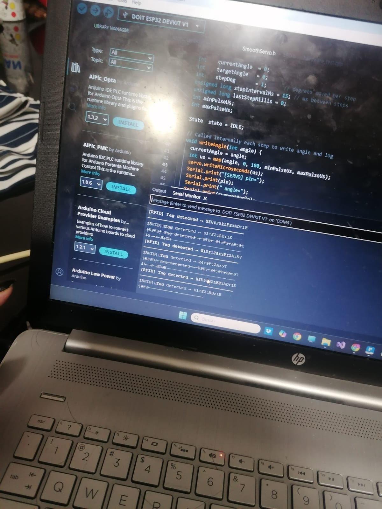

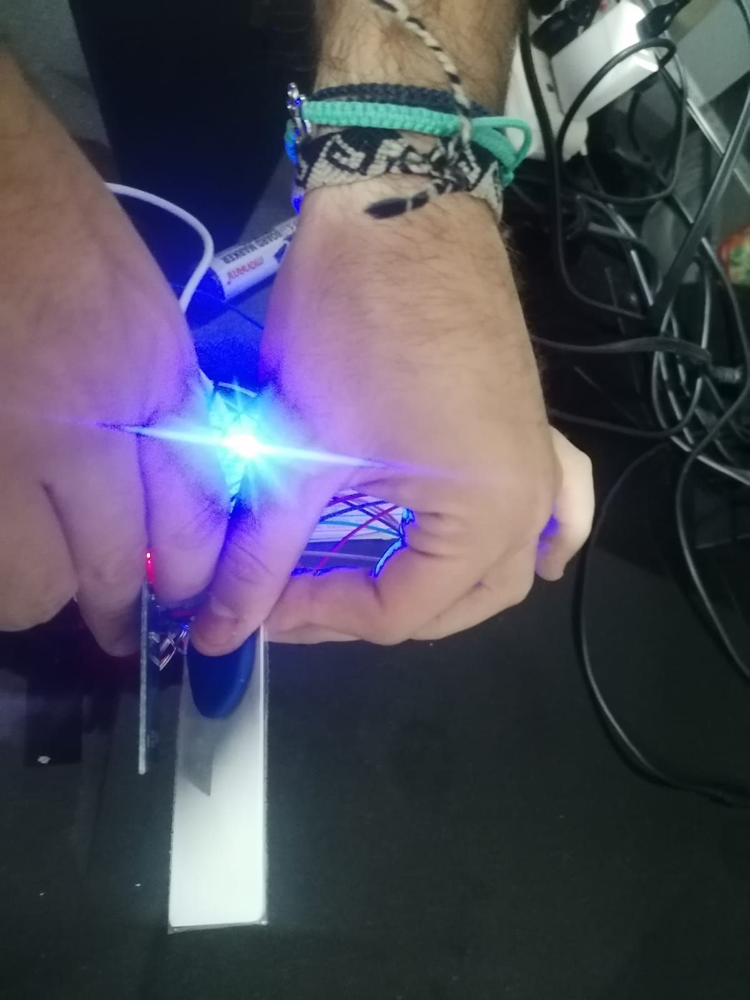
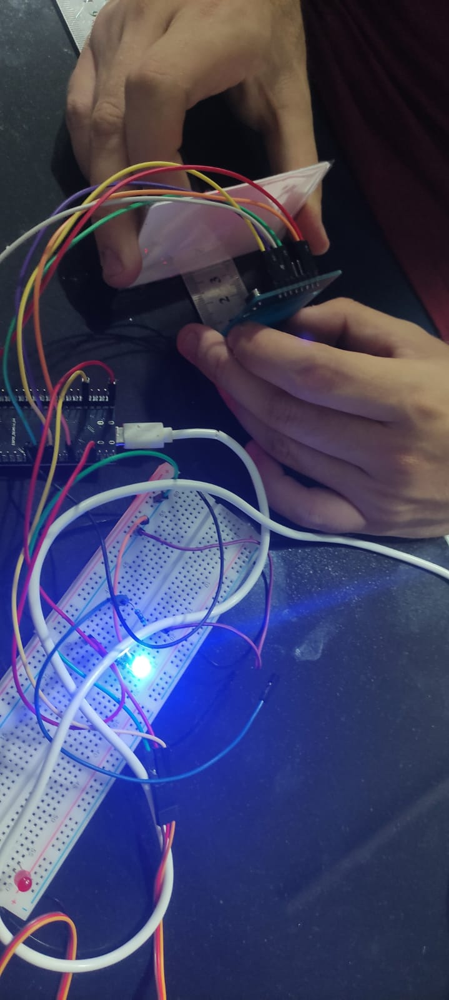

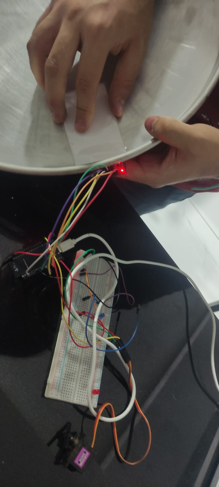
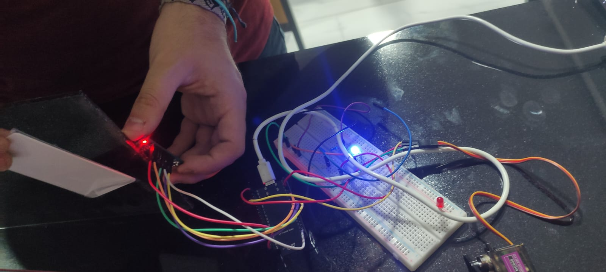
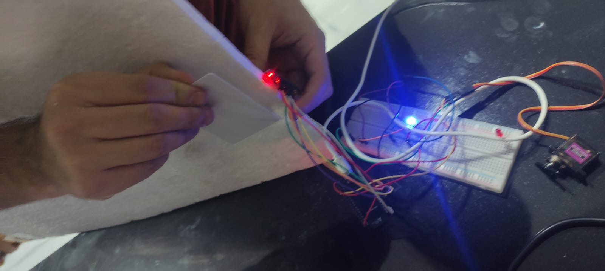
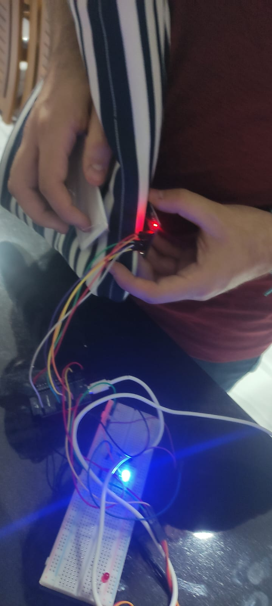

